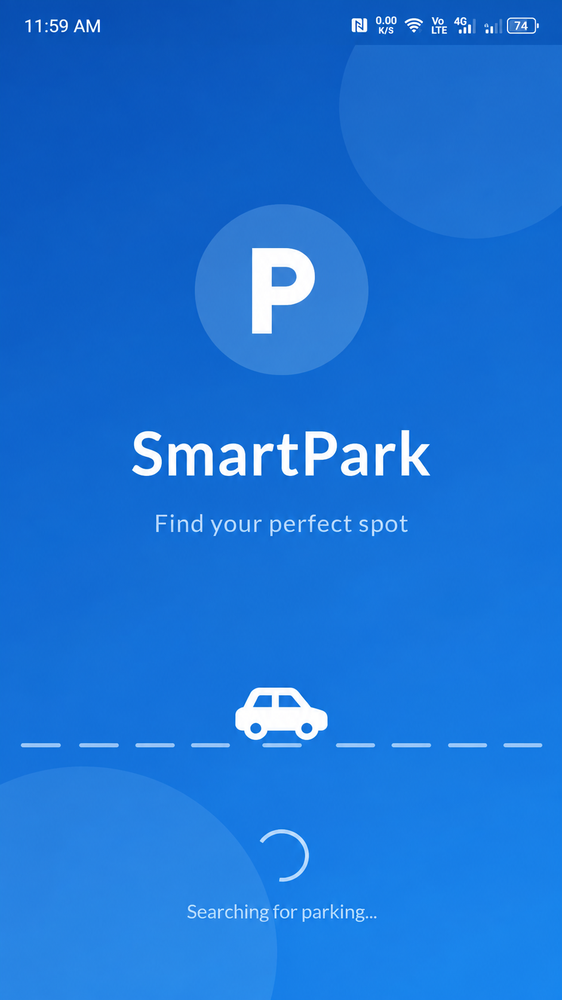
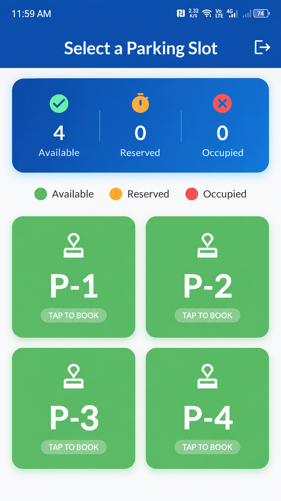
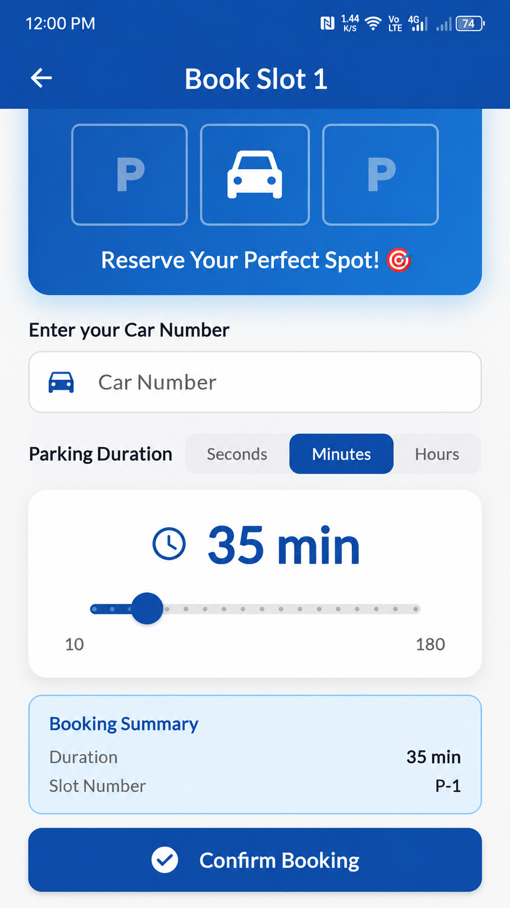
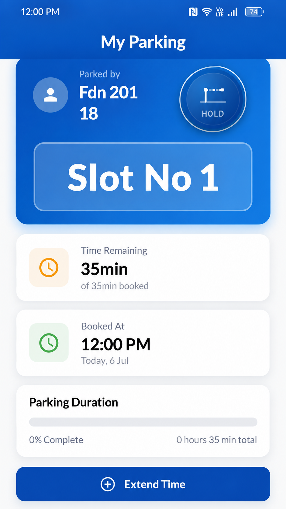
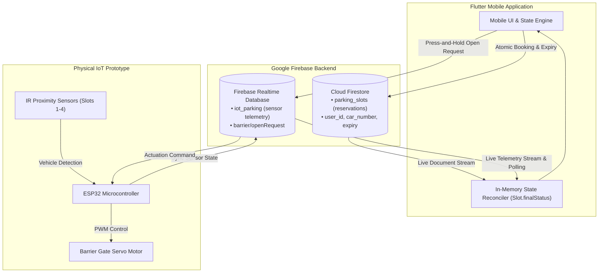

# 🚗 IoT Smart Parking System

> A Flutter + Firebase IoT parking solution that combines mobile reservations with real-time ESP32 sensor data.

**University Team Project · My Role: Software Developer**

[](https://flutter.dev)
[](https://dart.dev)
[](https://firebase.google.com)
[](https://firebase.google.com/docs/firestore)
[](https://firebase.google.com/docs/database)
[](https://www.espressif.com)
[](https://en.wikipedia.org/wiki/Internet_of_things)

---

## 📱 Project Preview

<!-- Add the four app screenshots to media/screenshots/ and uncomment below -->
<!--
<p align="center">
  
  
  
  
</p>
-->

| 1. Splash & Auth | 2. Slot Selection | 3. Book Slot | 4. Active Session & Barrier |
| :---: | :---: | :---: | :---: |
| *SmartPark animated launch & anonymous login* | *Live availability grid (Available / Reserved / Occupied)* | *Car number entry & custom duration slider* | *Real-time countdown, session extend & barrier control* |

> 📷 *Screenshots can be placed in `media/screenshots/` (`splash.png`, `slots.png`, `booking.png`, `my-parking.png`).*

---

## ℹ️ About the Project

Developed as a university team engineering project, this smart parking system bridges a mobile user interface with a physical IoT parking lot model. The Flutter application allows drivers to discover available spaces, book designated parking spots with custom durations, monitor active parking sessions with live countdowns, and remotely actuate an entry barrier servo gate.

---

## 🔄 How It Works

The architecture intentionally separates ACID-compliant reservation management from high-frequency IoT hardware telemetry using a dual-database design:



---

## ✨ Key Features

- **Live Multi-State Slots**: Real-time visualization of slots categorized as **Available** (Green), **Reserved** (Orange), or **Occupied** (Red).
- **Flexible Duration Booking**: Interactive slider supporting reservations in seconds (demo/testing), minutes, or hours.
- **Race-Condition Protection**: Firestore atomic transactions prevent concurrent double-booking of the same slot.
- **Hybrid State Engine**: Reconciles cloud reservation records with physical IR sensor readings to detect arrivals and unauthorized parking.
- **Hardware Barrier Control**: Animated 2-second press-and-hold button in Flutter that sends an actuation signal to the ESP32 via RTDB.
- **Session Dashboard**: Displays remaining time, percentage progress indicator, and active vehicle registration number.
- **Time Extension & Expiry Sweeps**: In-app parking time extension and automatic cleanup sweeps for expired reservations.
- **Failsafe Telemetry**: Realtime Database stream listener with an automated 3-second polling fallback in case of connection interruptions.

---

## 🗄️ Firebase + IoT Architecture

### Cloud Firestore
Serves as the persistent store for user reservations and session metadata:
- `parking_slots/{slotId}`: stores `status`, `user_id`, `car_number`, `booking_duration`, and `reserved_until` (epoch timestamp).

### Firebase Realtime Database
Optimized for low-latency hardware telemetry and barrier commands:

```text
iot_parking/
├── slot1/
│   ├── sensor_status: bool   # true = car present, false = empty
│   └── status: string        # "available" / "occupied"
├── slot2/
├── slot3/
└── slot4/

barrier/
└── openRequest: bool         # true = open requested by app; false = idle
```

---

## 👥 Team & Contributions

This project was developed as a collaborative university team effort:

- **Software Developer (My Role)**:
  - Architected the Flutter mobile application (UI/UX, GoRouter, Provider state management).
  - Implemented the dual-database integration (Cloud Firestore + Firebase Realtime Database).
  - Designed the hybrid state reconciliation engine ([`Slot.finalStatus`](lib/src/models/slot.dart)).
  - Built atomic booking transactions, duration calculators, countdown timers, and the press-and-hold barrier actuation widget.
- **Hardware & Embedded Teammates**:
  - Constructed the physical scale-model parking layout and barrier gate.
  - Wired the ESP32 microcontroller, IR proximity sensors, and SG90 servo motor.
  - Implemented the embedded firmware logic for sensor reading and barrier actuation.

---

## 🚀 Getting Started

### Prerequisites
- [Flutter SDK](https://docs.flutter.dev/get-started/install) (3.9+)
- A Firebase project with Cloud Firestore and Realtime Database enabled

### Configuration
1. Clone the repository:
   ```bash
   git clone https://github.com/YOUR_USERNAME/iot-smart-parking.git
   cd iot-smart-parking
   ```
2. Set up Firebase configuration files:
   - Copy `lib/firebase_options.dart.example` to `lib/firebase_options.dart` and fill in your Firebase credentials (or run `flutterfire configure`).
   - Copy `android/app/google-services.json.example` to `android/app/google-services.json` with your Android app config.
3. Install dependencies and run:
   ```bash
   flutter pub get
   flutter run
   ```
